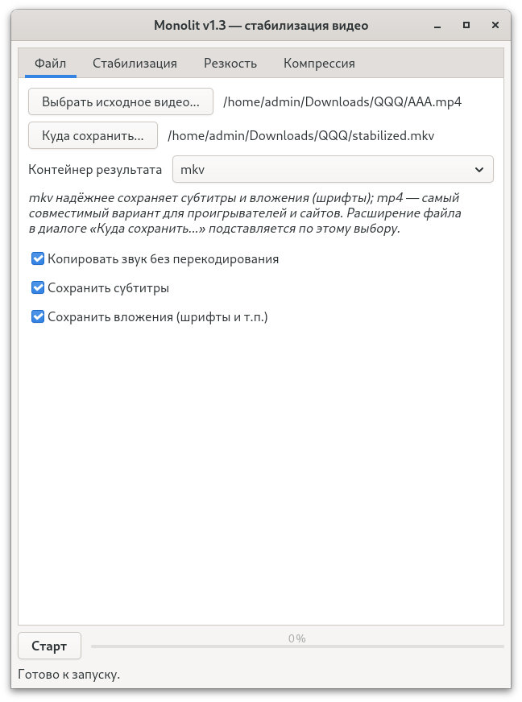
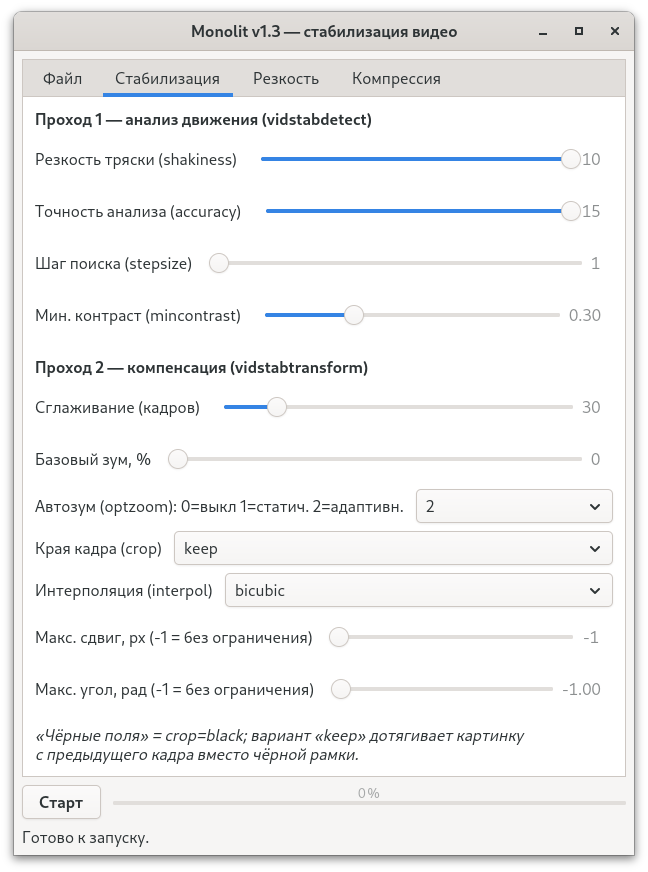
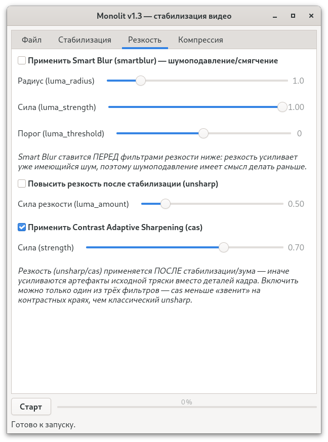
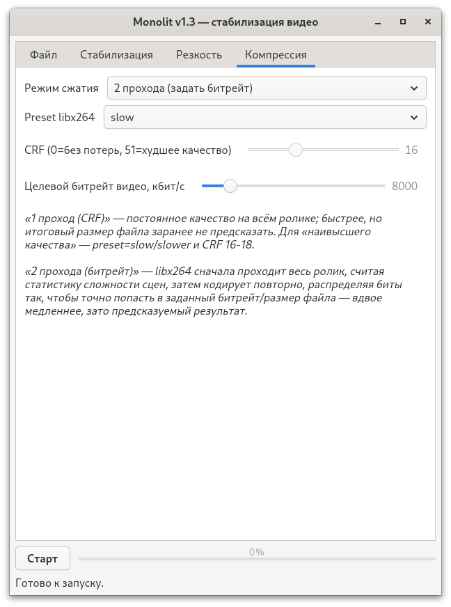

# Monolit — User and Developer Manual

A complete description of the features, interface, architectural
decisions, and build process of the Monolit application. A short
technical reference is available in [README.md](./README.md).

## Contents

- [Features](#features)
- [Appearance](#appearance)
- [Application tabs](#application-tabs)
- [Why GTK4 is not statically linked](#why-gtk4-is-not-statically-linked)
- [Why both stabilization passes run sequentially, not in parallel](#why-both-stabilization-passes-run-sequentially-not-in-parallel)
- [Numeric locale and FFmpeg (LC_NUMERIC)](#numeric-locale-and-ffmpeg-lc_numeric)
- [Build details](#build-details)
- [Known historical Windows build issue (fixed)](#known-historical-windows-build-issue-fixed)
- [Stopping processing and closing the window](#stopping-processing-and-closing-the-window)
- [Code style](#code-style)
- [Interface language](#interface-language)
- [Relative paths in build helper files](#relative-paths-in-build-helper-files)

## Features

- Camera-shake stabilization (`vid.stab`) with full control over the
  parameters of both passes — motion analysis accuracy and the
  subsequent smoothing/zoom.
- Optional noise reduction (Smart Blur) and sharpening after
  stabilization (unsharp and/or Contrast Adaptive Sharpening).
- `libx264` video compression in two modes: constant quality (CRF,
  1 pass) or precise target bitrate (2 passes).
- Copying of audio, subtitles, and container attachments without
  re-encoding.
- Processing progress and status shown directly in the interface,
  without blocking the window.
- Interface language switching (Russian/English) without restarting
  the application.

## Appearance



## Application tabs

### 1. File


- Selecting the input video.
- Selecting the output save path.
- Selecting the output container — **mp4** or **mkv**. This
  determines the file extension and, accordingly, the libavformat
  muxer: mkv is more reliable at preserving subtitles and attachments,
  while mp4 is more compatible with players and websites. The file
  extension in the "Save as..." dialog is set automatically based on
  this choice.
- Independent toggles:
  - "Copy audio without re-encoding"
  - "Keep subtitles"
  - "Keep attachments" (fonts, etc. in mkv)

  All three are enabled by default.

### 2. Stabilization



**Pass 1 (`vidstabdetect`)** — motion analysis:

- `shakiness` (1–10)
- `accuracy` (1–15)
- `stepsize`
- `mincontrast`

By default, the parameters are set to maximum analysis accuracy
(10 / 15 / 6 / 0.3).

**Pass 2 (`vidstabtransform`)** — compensation:

- `smoothing` — trajectory smoothing across frames
- `zoom` — base zoom, %
- `optzoom` — auto zoom: 0 = off, 1 = static, 2 = adaptive
- `crop` — handling of frame edges:
  - `keep` — stretch the picture from the previous frame at the edges
  - `black` — honest black bars where the original image is not
    enough after shift compensation
- `interpol` — interpolation used during frame transformation (default
  `bicubic` — the most accurate)
- `maxshift` / `maxangle` — limits on maximum shift (px) and rotation
  angle (rad); a value of `-1` means "no limit"

### 3. Sharpness



- **Smart Blur (`smartblur`)** — noise reduction/softening
  (`luma_radius`, `luma_strength`, `luma_threshold`). Placed BEFORE the
  sharpening filters below: sharpening amplifies existing noise, so it
  makes sense to denoise first.
- **Unsharp** (`luma_amount`) and **Contrast Adaptive Sharpening
  (CAS)** (`strength`) — applied AFTER stabilization/zoom, otherwise
  they would amplify the artifacts of the original shake rather than
  the frame's detail. CAS "rings" less on high-contrast edges than
  classic unsharp. Both sharpening filters can be enabled at the same
  time; Smart Blur is an independent toggle.

### 4. Compression



- `libx264` encoder `preset`.
- Bitrate control mode:
  - **1 pass (CRF)** — constant quality throughout the clip; faster,
    but the resulting file size cannot be predicted in advance. For
    the highest quality, use `preset=slow`/`slower` and `CRF 16–18`.
  - **2 passes (set bitrate)** — `libx264` first scans the entire clip,
    computing scene-complexity statistics (pass A), then encodes again
    (pass B), distributing bits so as to precisely hit the target
    video bitrate. Twice as slow, but the file size is predictable.

  The "Target video bitrate" slider is active only in 2-pass mode, and
  CRF only in 1-pass mode; switching modes immediately disables the
  unused control.

## Why GTK4 is not statically linked

FFmpeg/x264/vidstab are libraries without runtime loading of external
modules, so they can be statically linked like ordinary code. GTK4 is
different: it has a modular loader system (gdk-pixbuf, icon theme,
GSettings schemas, immodules) that looks for `.so`/`.dll` files and
data files in standard paths at application runtime — this cannot be
resolved at link time. Therefore:

- **Fedora**: GTK4 is installed system-wide (`sudo dnf install
  gtk4-devel` for building, `gtk4` for running) — this is how the vast
  majority of GTK applications work on the distribution.
- **Windows**: the GTK4 runtime is built via MSYS2/mingw64
  (`pacman -S mingw-w64-x86_64-gtk4`) and shipped alongside
  `Monolit.exe` (DLLs + `share/glib-2.0/schemas` + `share/icons`) —
  exactly the way GIMP, Inkscape, and other GTK applications do it on
  Windows. Nobody in the industry ships a fully static GTK.

## Why both stabilization passes run sequentially, not in parallel

`vidstabdetect` builds a single camera motion trajectory over the
entire clip, and `vidstabtransform` smooths it while looking at frames
both before and after the current one. If the video were split into
independent chunks for parallel processing across threads, each chunk
would get its own trajectory, uncoordinated with its neighbors —
noticeable jerks would appear at the seams, defeating the whole point
of stabilization. That's why both passes in Monolit run over the whole
video and strictly sequentially.

Parallelism is not gone, though — it remains at the level of FFmpeg's
own decoder/encoder/filter multithreading (`thread_count`/
`thread_type`), and the entire processing runs in a separate OS thread
only so as not to block the GTK event loop.

## Numeric locale and FFmpeg (LC_NUMERIC)

On initialization, GTK4 calls `setlocale(LC_ALL, "")` itself, picking
up the user's entire system locale — including `LC_NUMERIC`. In
locales where the decimal separator is a comma (`ru_RU`, `de_DE`, and
most European locales), this breaks parsing of numeric filter-graph
arguments in FFmpeg: `libavutil` (`av_expr`/`strtod`), when parsing,
for example, `mincontrast=0.300` under such a locale, reads only `0`,
hits `.300`, and fails with an error like `Invalid chars '.300' at the
end of expression '0.300'`. The same would affect `zoom`, `maxangle`,
and the `smartblur`, `unsharp`, and `cas` parameters as well.

Nim always formats floats using a dot regardless of the process
locale, so the string generation itself is correct — it's the
filter's parsing of it that breaks. `libavutil` always expects a `C`
locale for numbers, so after GTK starts (in the `activate` handler,
after GTK has already done its own `setlocale`), Monolit forcibly
resets `LC_NUMERIC` back to `"C"`, without touching the other locale
categories (interface translations, etc. are unaffected).

## Build details

```bash
# Fedora, native
nim c -d:release --threads:on Monolit.nim

# Windows, cross-compiled from Fedora (mingw-w64)
nim c -d:release --threads:on --os:windows Monolit.nim
```

The first build for each target will build libvidstab → (libx264 on
Windows) → static FFmpeg from scratch — this takes time; subsequent
builds use the cache in `vidstab_build*/`, `x264_build_windows/`,
`ffmpeg_build*/` (see `config.nims`).

Before building for Windows on Fedora, the GTK4 runtime for mingw64
must be installed (`sudo dnf install mingw64-gtk4`, or via MSYS2),
otherwise `pkg-config --libs gtk4` in `src/gtk4_api.nim` won't find the
required `.dll.a` files.

The remaining dependencies (vid.stab, x264, FFmpeg) are built by
`config.nims` itself from source on the first build — there is no need
to install them manually.

## Known historical Windows build issue (fixed)

The first Windows cross-build could fail as early as the libvidstab
build step with a CMake error like `ld.bfd: unknown option
"--major-image-version"` and a break at `CMakeTestCXXCompiler`. The
cause: vid.stab's own CMakeLists.txt does not explicitly restrict the
list of languages and enables C++ alongside C, while `config.nims`
specified the C compiler (`CMAKE_C_COMPILER`) for the cross-build but
not the C++ one — as a result, CMake found the host (native) `c++`,
while `CMAKE_SYSTEM_NAME=Windows` still forced it to add PE-specific
linker flags that the native `ld.bfd` doesn't understand. Fixed by
explicitly specifying `CMAKE_CXX_COMPILER=x86_64-w64-mingw32-g++`
(along with `CMAKE_RC_COMPILER`) next to the C compiler — see the
detailed comment in `buildVidstab` in `config.nims`.

After that, the build proceeds further (vidstab → dav1d → FFmpeg), but
could fail again at the stage of compiling the Nim sources themselves,
with `pkg-config: Package gtk4 was not found in the pkg-config search
path` — and the text of this pkg-config error, once it lands in
`gorge()`, leaks straight into `gcc`'s arguments (the log is full of
"linker input file not found" for words like `Package`/`was`/`not`/
`found`).

The cause was twofold: `PKG_CONFIG_LIBDIR` for Windows used to be set
only inside `buildFFmpeg` (and wasn't set at all when the FFmpeg build
was cached), and the directory list itself didn't include Fedora's
standard path for mingw64 packages' .pc files.

Fixed:

- setting `PKG_CONFIG_LIBDIR`/`PATH` is now done unconditionally on
  every build;
- the list now includes
  `/usr/x86_64-w64-mingw32/sys-root/mingw/lib/pkgconfig` (where Fedora
  places `gtk4.pc` for `mingw64-gtk4`);
- `config.nims`/`src/gtk4_api.nim` additionally check pkg-config's
  return code and stop the build with a clear message instead of
  passing the error text to the compiler as flags.

## Stopping processing and closing the window

The "Stop" button asks the background thread to stop at the nearest
check point between packets and waits for it to finish asynchronously
(via a progress-polling timer), without blocking the interface.

Closing the window during active processing is handled separately and
differently: to avoid leaving FFmpeg contexts half-finished and the
output file unwritten and potentially corrupted, the `close-request`
handler synchronously asks the thread to stop and waits for it to
finish (at the cost of a brief interface freeze), and only then allows
the window to close. The unfinished result is deleted automatically in
this case too, just as with a regular stop via the button.

## Code style

The project's code follows several formatting conventions:

- **Call syntax**: the function name always comes first, with all
  arguments in parentheses after it (`startsWith(str, "John")`,
  `len(a)`, `close(f)`), rather than via a dot (`str.startsWith
  ("John")`). The dot is used only to access a struct/object field
  (`cfg.inputFile`, `w.progressBar`) — never for calling procedures or
  type conversion (`cint(x)`, not `x.cint`). The exception is `echo`.
- **Declaring two or more constants/variables** of the same kind is
  done as a block: the `const`/`let`/`var` keyword on its own line,
  with the declarations themselves indented on the following lines,
  rather than one declaration per `let`/`var` line.
- **Imports** are combined with commas on one line (`import
  std/[strformat, os, strutils]`, `import gtk4_api, stabilizer`);
  several separate `import` statements are kept only where they are
  logically distinct (for example, a separate import with an
  explanatory comment that applies only to it).

## Interface language

At the bottom of the "File" tab there is an interface language switch
(Russian / English), which switches without restarting the
application. The default is Russian. Technical lists (mp4/mkv,
keep/black, no/linear/bilinear/bicubic, libx264 presets) are
intentionally not translated — these are common technical
designations, the same in both languages.

## Relative paths in build helper files

The generated `vidstab_build*/lib/pkgconfig/vidstab.pc` uses the
`${pcfiledir}` variable (substituted by pkg-config itself — it's the
directory where the `.pc` file itself resides) instead of the absolute
project directory path baked in at build time. This means the project
directory can be renamed, copied to another machine, or built under a
different user — the `.pc` file remains working without any edits.
